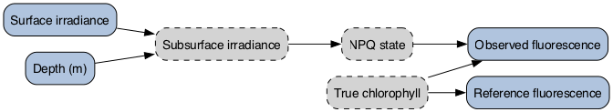
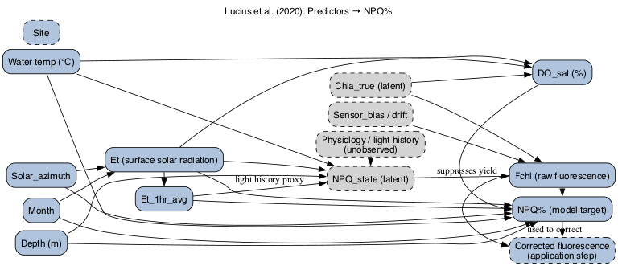
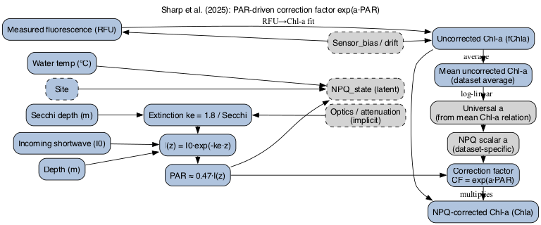
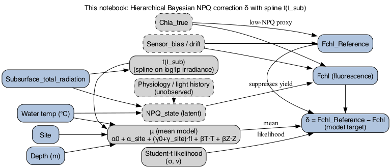
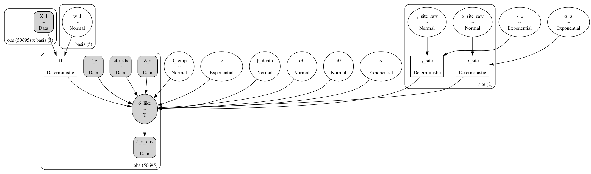
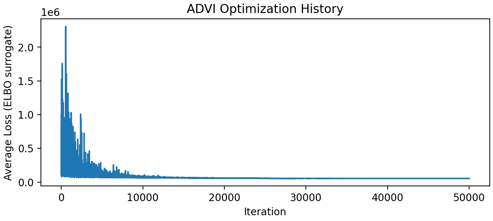
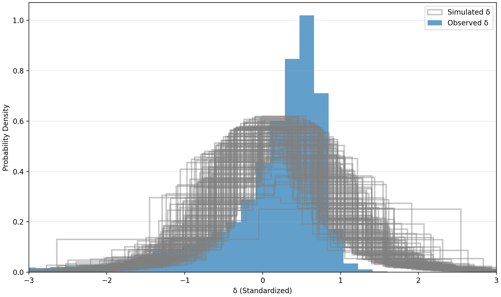

## Background

This work presents an exploratory Bayesian re-analysis of non-photochemical quenching (NPQ) correction using in situ fluorescence data from Lake George. The goal is to demonstrate how hierarchical Bayesian modeling can be used to (i) represent uncertainty in NPQ correction explicitly, (ii) borrow strength across study sites via partial pooling, and (iii) separate model (epistemic) uncertainty regarding the underlying light–response relationship from the measurement (aleatoric) uncertainty inherent in observation-level noise.

::: {.callout-tip title="Non-Photochemical Quenching (NPQ): What is it?"}

Fluorescence is widely used in aquatic sciences as a non-invasive, high-resolution proxy for chlorophyll-a to estimate phytoplankton biomass and primary productivity across diverse ecosystems. However, non-photochemical quenching (NPQ)—a photoprotective process where algae dissipate excess light energy as heat—artificially depresses this signal under bright conditions, leading to significant underestimates of actual biomass if left uncorrected.

:::

The analysis is intended as a methodological demonstration, rather than a definitive replacement for existing correction schemes. In particular, I emphasize assumption transparency, principled uncertainty quantification, and the importance of causal thinking in modeling the NPQ process.

To my knowledge NPQ corrections are formulated as globally learned relationships between irradiance and fluorescence quenching. However, both optical conditions and phytoplankton community structure vary across sites, making it unlikely that a single correction curve applies uniformly. A Bayesian generative model allows this heterogeneity to be represented explicitly, rather than treated as noise or bias.

## The NPQ correction problem at a glance

[@fig-npq-dag] summarizes the physical and biological processes involved in NPQ correction. In a nutshell, incident surface light determines subsurface irradiance, which drives NPQ. In turn, NPQ suppresses fluorescence yield relative to latent chlorophyll concentration. Reference fluorescence provides a low-NPQ proxy, while several biological and optical processes remain unobserved.

> ***"Latent"* variables are not directly measured (such as the true chlorophyll concentration or the physiological quenching state) but influence the observed data and that can be inferred through careful modeling.**

::: {#fig-npq-dag}

*Conceptual DAG of the NPQ correction problem. Subsurface irradiance drives a latent NPQ state that suppresses fluorescence yield relative to true chlorophyll concentration, while reference fluorescence provides a low-NPQ proxy. Observed quantities are shown in blue and latent processes in gray. This diagram is intentionally schematic. Its purpose is not to assert a complete causal model, but to provide a shared conceptual starting point for the discussion that follows.*

:::

## Some recent framings of NPQ correction

Several recent approaches to NPQ correction illustrate different ways of operationalizing the conceptual picture above. Rather than reviewing the full literature, the examples below highlight contrasting modeling choices that have appeared in the past few years and that motivate different assumptions about physiology, optics, and uncertainty.

### A feature-rich predictive framing 

In this framing examplified by [@Lucius2020NPQ], NPQ is treated as a target variable to be predicted from a broad set of covariates. The emphasis is on predictive performance rather than on explicit representation of latent processes, making the approach flexible but less transparent in terms of which assumptions drive the correction.

::: {#fig-lucius2020-dag}

*DAG representation of the [@Lucius2020NPQ] framing. NPQ is modeled directly as a function of multiple observed environmental and sensor-derived predictors, while latent physiological processes are left implicit.*

:::

In this approach [@Sharp2025NPQ], NPQ is not predicted directly but inferred through a prescribed functional relationship with subsurface irradiance. This yields a more structured and mechanistically motivated correction, at the cost of collapsing diverse physiological responses into a fixed form.

### A structured PAR-driven correction

::: {#fig-sharp2025-dag}

*DAG representation of the @Sharp2025NPQ framing. Subsurface irradiance is treated as the primary driver of NPQ through a prescribed functional relationship, with physiological complexity summarized by a small number of parameters.*

:::

These recent approaches illustrate two contrasting strategies: one that treats NPQ as a derived response to be modeled conditionally on many observed covariates, and another that prescribes a fixed functional relationship between irradiance and fluorescence correction. Both motivate an alternative framing in which NPQ correction is treated as a latent process inferred jointly with uncertainty.

## A hierarchical Bayesian approach to NPQ correction

Here, NPQ correction is treated as a latent quantity inferred from the data, rather than as a derived response modeled conditionally on many predictors or as the result of a prescribed functional adjustment. The focus is on modeling the correction itself while making uncertainty and shared structure explicit.

The model targets the NPQ correction δ, defined as the difference between reference fluorescence and observed fluorescence. Working on this scale keeps the model close to the measurement process and allows uncertainty to propagate directly to corrected fluorescence.

The dependence of NPQ correction on irradiance is represented using a flexible nonlinear function. This allows the data to inform the shape of the light–NPQ relationship without committing to a fixed parametric form or a specific physiological parameterization.

Depth and temperature are included as additional predictors of the mean correction, capturing well-known environmental influences on fluorescence yield while remaining agnostic about the underlying mechanisms. Other available variables are intentionally excluded to preserve interpretability and avoid conditioning on downstream proxies.

Measurements from multiple sites are modeled jointly using partial pooling. A shared irradiance response is learned across sites, while allowing site-level deviations through hierarchical effects. This structure balances borrowing strength across datasets with the recognition that local conditions modulate NPQ behavior.

::: {#fig-my-model-concept}

*DAG summarizing the Bayesian NPQ correction model. The correction δ is treated as a latent quantity driven by irradiance and contextual variables, with shared structure and site-level variation modeled explicitly.*

:::

### Modeling framework

The statistical model is implemented in PyMC. In addition to the conceptual DAG above, the probabilistic structure of the implementation can be summarized by its computational graph (*cf.* [@fig-pymc-model]). This graph makes explicit the quantities treated as random variables, the deterministic transformations used, and how information flows during inference.

::: {#fig-pymc-model}

*PyMC Graphviz representation of the NPQ correction model. Plates indicate repeated structure: the observation plate (≈50k) indexes the likelihood and deterministic transformations, the spline basis (5 functions) indexes both the irradiance design matrix and its shared coefficients, and the site plate (2) indexes site-specific parameters. The graph emphasizes how a small number of shared parameters generate observation-level corrections at scale.*

:::

Inference is performed using automatic differentiation variational inference, [ADVI, @Kucukelbir2015AVI] to accommodate the large number of observations. ADVI approximates the posterior with a parametric distribution by optimizing a variational objective using gradient-based methods, trading exactness for speed and scalability. The intent here is exploratory: to examine model behavior, uncertainty, and implied corrections in a computationally tractable setting.

## Model diagnostics and posterior predictive checks

Model diagnostics focus on two questions: whether the variational optimization has stabilized (Figure [@fig-advi-opt]), and whether the fitted model reproduces key features of the observed data (Figure [@fig-ppc-distribution]). Given the exploratory use of variational inference, emphasis is placed on posterior predictive behavior rather than asymptotic sampling guarantees.

### Optimization behavior

::: {#fig-advi-opt}

*ADVI optimization history. The rapid decrease and subsequent stabilization of the variational objective indicate convergence of the optimization procedure.*
:::

### Distributional posterior predictive check

:::{#fig-ppc-distribution}

*Population-level (across sites)  observed standardized NPQ corrections (δ) are compared to simulated δ generated by sampling from the posterior predictive distribution of the fitted hierarchical model. The blue histogram shows the empirical (observed) distribution of δ, while the overlaid gray histograms correspond to multiple draws from the posterior predictive distribution. Good agreement indicates that the model captures both the central tendency and tail behavior of the correction, including heavy-tailed variability modeled via a Student-t likelihood. At the same time, systematic discrepancies in location, spread, or tails suggest model mis-specification or underestimation of uncertainty. The posterior predictive distribution reproduces the overall location of the data but is broader and more symmetric than the observed distribution, which exhibits a sharper and asymmetric shape. This residual mismatch in dispersion and shape suggests that the model may not fully capture the complexity of the data's tail behavior, consistent with known limitations of mean-field variational inference, which can oversmooth variability and favor approximately near-Gaussian predictive behavior.*
:::

### NPQ with depth

:::{#fig-npq-vs-depth}
<iframe
  src="figures/interactive/npq_corr.html"
  width="100%"
  height="520"
  style="border: 0;"
  loading="lazy">
</iframe>

*Uncertainty-aware NPQ predictions versus depth. This plot is interactive $\Rightarrow$ hover to inspect points and zoom to explore depth ranges where NPQ behavior changes. Black triangle $\rightarrow$ observed data; colored points $\rightarrow$ median predictions; colored horizontal bars $\rightarrow$ 94% credibility intervals.*
:::

@fig-npq-vs-depth shows posterior NPQ correction curves for individual locations, with 95% credible intervals. Differences across sites likely reflect a combination of ecological variability, measurement conditions, and unobserved state variables. Importantly, the width of the credible intervals varies by site, indicating where the data meaningfully constrain the correction and where uncertainty remains high.

:::{#fig-npq-curve}
<iframe
  src="figures/interactive/npq_curve.html"
  width="100%"
  height="520"
  style="border: 0;"
  loading="lazy">
</iframe>

*Learned NPQ–irradiance response (population-level spline on $log_{10}$-transformed irradiance)*
:::

