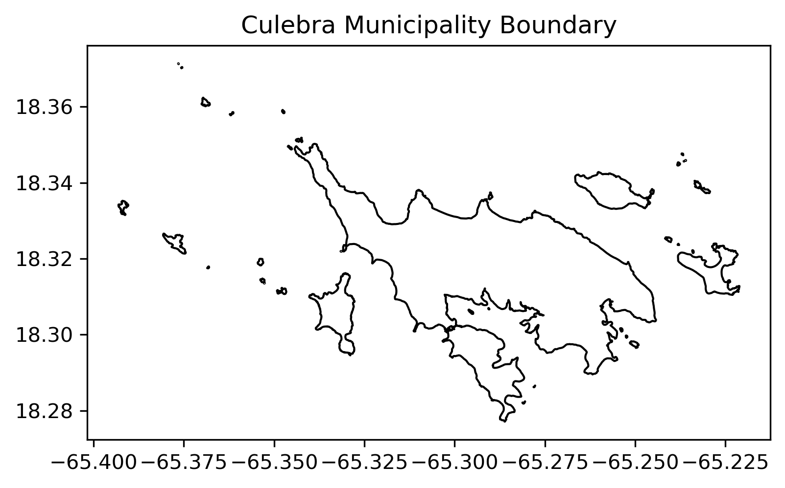
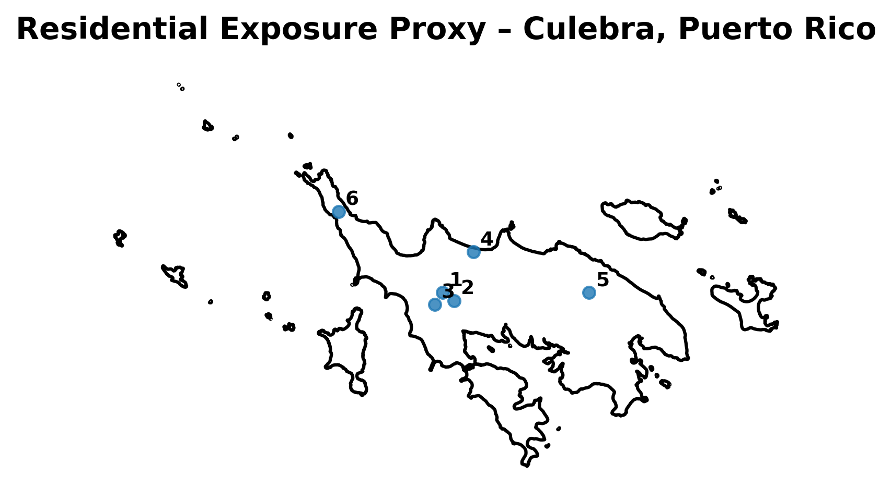
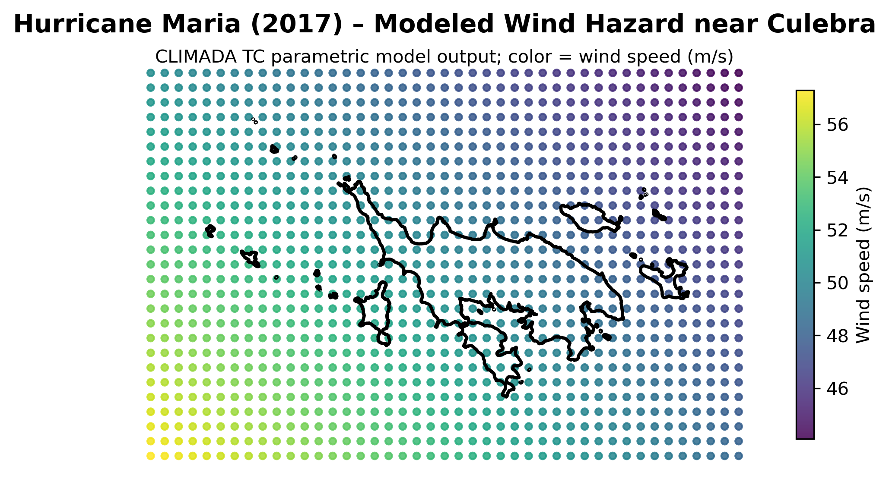
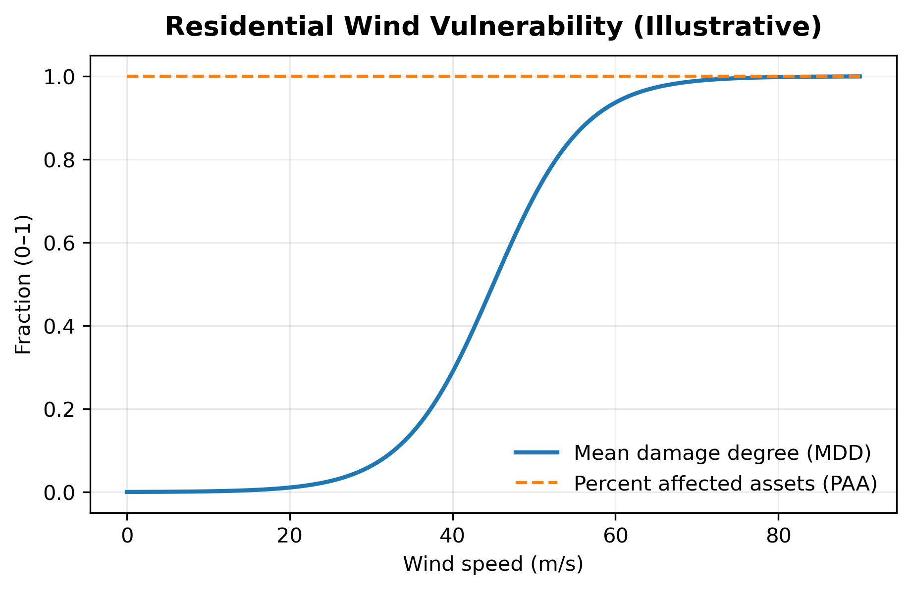
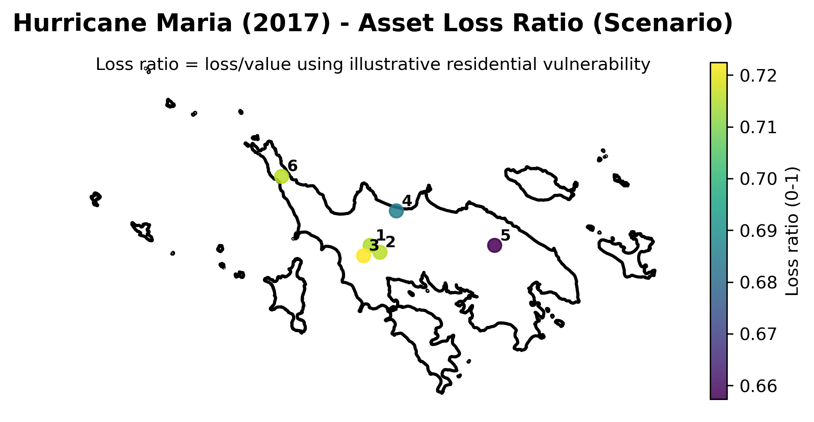

# Executive Summary

This report presents a **climate risk proof-of-concept** for **Culebra, Puerto Rico**, using **Hurricane Maria (2017)** as a historical stress-test scenario. The objective is to demonstrate a transparent, physics-informed workflow for estimating **storm-driven physical damage** to residential assets at the municipal scale, suitable as a foundation for more comprehensive climate risk analytics.

The analysis integrates three core components:

1. A parametric *tropical cyclone wind hazard* model driven by historical storm track data,
2. A spatially explicit but synthetic *residential exposure proxy*, and
3. An illustrative *wind vulnerability function* linking wind intensity to structural damage.

Using this framework, the study estimates scenario-based physical losses associated with Hurricane Maria-level winds affecting Culebra. Results indicate that, under modeled conditions, residential structures may experience *meaningful physical damage* with asset-level loss ratios reaching up to 70%+ of replacement value in the most exposed areas. Aggregate modeled losses for the synthetic exposure portfolio are on the order of $500,000 USD (see Table 1).

**Table 1. Modeled Residential Loss Summary – Hurricane Maria (2017)**

| Metric                          | Value            | Units |
|---------------------------------|------------------|-------|
| Number of residential assets    | 6       | count |
| Total exposed value             | 750,000.00 | USD   |
| Total modeled loss              | 527,130.36     | USD   |
| Mean loss ratio                 | 0.70        | -     |
| Maximum loss ratio              | 0.72         | -     |

# 2. Study Area and Exposure Representation

## 2.1 Study Area

The study area for this proof-of-concept analysis is **Culebra**, an island municipality located east of the main island of Puerto Rico. Culebra’s small geographic extent, coastal exposure, and limited infrastructure redundancy make it a suitable case for demonstrating localized climate risk analytics.

The analysis domain is defined using an administrative boundary polygon for the municipality. All spatial data are represented in geographic coordinates (latitude/longitude, EPSG:4326), consistent with the storm track and hazard modeling inputs.

---

## 2.2 Exposure Representation

This proof-of-concept uses a **synthetic residential exposure proxy** rather than parcel-level or building inventory data. The objective is to demonstrate analytical workflow and model integration rather than to estimate definitive loss magnitudes.

The exposure proxy consists of a small set of representative residential assets distributed across the island. Each asset is characterized by:
- a geographic location,
- an asset class (“residential”), and
- an assigned **replacement value** in U.S. dollars.

Replacement value is interpreted as the cost to rebuild the structure under normal conditions. It is distinct from market value, insured value, or tax assessment value.

> **Interpretive note:**  
> Loss estimates scale linearly with exposure value. Absolute loss magnitudes in this report therefore reflect the assumed proxy exposure and should not be interpreted as comprehensive estimates of total residential losses for Culebra.

---

## 2.3 Exposure Assumptions and Scope

The exposure proxy makes several simplifying assumptions:

- All assets represent residential structures with broadly similar construction characteristics.
- Asset values are illustrative and intended to support relative comparisons rather than absolute valuation.
- No distinction is made between building structure and contents.
- Critical infrastructure, commercial assets, and public buildings are excluded.

The above simplifications allow the analysis to focus on the interaction between hazard intensity and structural vulnerability.

---

## 2.4 Implications for Interpretation

Because exposure data are synthetic, results from this analysis should be interpreted as **scenario-based indicators of potential damage patterns**, not as a comprehensive accounting of municipal-scale losses.

In a full production assessment, this exposure layer would be replaced with:

- parcel-level building inventories,
- construction-type classifications,
- occupancy and use information, and
- updated replacement cost estimates.

Such extensions are discussed in Section 6.

---

# 3. Hazard Characterization: Hurricane Maria Wind Fields

## 3.1 Event Selection and Context

Hurricane Maria (2017) is used as the hazard scenario for this proof-of-concept analysis. Maria was one of the most destructive hurricanes to affect Puerto Rico in recent history and therefore provides a relevant stress-test for localized wind risk.

Storm track and intensity information are derived from the IBTrACS global tropical cyclone archive. The track represents the **location of the storm center (eye) over time**, not the spatial footprint of damaging winds.

This distinction is important: damaging winds extend outward from the eye and may affect locations that the track itself does not directly intersect.

---

## 3.2 Wind Hazard Modeling Approach

Wind hazard is modeled using a **parametric tropical cyclone wind model**, which estimates surface wind speed as a function of:

- storm intensity,
- radial distance from the storm center, and
- storm evolution over time.

For each spatial evaluation point (“centroid”), the model computes the **maximum 1-minute sustained wind speed at 10 meters above ground level** experienced over the duration of the event. Wind speeds are expressed in meters per second (m/s).

This approach is physics-informed and computationally efficient, making it suitable for both scenario analysis and large-scale risk modeling.

---

## 3.3 Spatial Representation of Hazard

Wind intensity is evaluated on a regular spatial grid covering the study area and its immediate surroundings. This grid is independent of the exposure locations and serves as the basis for sampling wind intensity at asset locations during impact calculation.

Modeled peak wind speeds in the vicinity of Culebra reach approximately **O(50–60 m/s)** under this scenario. These values reflect model assumptions and spatial averaging and should not be interpreted as direct observations at specific structures.

---

## 3.4 Interpretation and Limitations of the Hazard Model

Several points are important for interpreting the modeled hazard:

- The wind field is **modeled**, not observed.
- Local effects such as topography, shielding, and surface roughness are simplified.
- Wind intensity represents peak sustained wind, not gusts.
- The analysis considers a **single historical event**, not a probabilistic distribution of storms.

Despite these limitations, the modeled wind field provides a physically consistent representation of hurricane wind hazard suitable for scenario-based impact estimation.

---

# 4. Impact Modeling Framework

## 4.1 Conceptual Approach

Physical impact is estimated using a standard catastrophe risk modeling formulation that combines **hazard**, **exposure**, and **vulnerability**:

$$
\text{Impact} = \text{Hazard} \times \text{Exposure} \times \text{Vulnerability}
$$

In this context:

- **Hazard** represents modeled wind intensity at specific locations,
- **Exposure** represents the value and location of assets at risk, and
- **Vulnerability** describes how assets respond to hazard intensity in terms of physical damage.

This framework separates physical processes (wind forcing and structural response) from economic or financial considerations, allowing each component to be examined and refined independently.

---

## 4.2 Vulnerability Representation

Vulnerability is represented using an **illustrative residential wind vulnerability function** that maps wind speed (m/s) to expected structural damage.

Damage is expressed as a **loss ratio**, defined as the fraction of an asset’s replacement value that is expected to be lost due to wind damage under a given hazard intensity.

For this proof-of-concept:

- Vulnerability is defined using a smooth, monotonic damage curve.
- The curve reflects increasing damage severity with increasing wind speed.
- All assets are assumed to be affected once wind speeds exceed low thresholds.

The vulnerability function is intentionally simple and transparent. Its purpose is to demonstrate model mechanics rather than to provide engineering-grade damage estimates.

---

## 4.3 Interpretation of Loss Ratios

A modeled loss ratio takes values between 0 and 1 and is interpreted as follows:

- **0.0**: no physical damage  
- **0.2**: damage equivalent to approximately 20% of replacement cost  
- **1.0**: total loss (asset effectively destroyed)

In this formulation, the loss ratio can be written as:

$$
\text{Loss Ratio} = \frac{\text{Modeled Loss}}{\text{Replacement Value}}
$$

Loss ratios represent **expected physical damage**, not realized repair costs. They do not include:

- post-disaster cost inflation,
- code upgrades or retrofits,
- debris removal,
- indirect economic losses, or
- insurance or financing effects.

As a result, actual repair expenditures following a disaster may exceed modeled losses.

---

## 4.4 Impact Calculation

For each residential asset, modeled wind intensity is sampled from the hazard field and combined with the vulnerability function to compute asset-level loss ratios and monetary losses.

At the asset level, modeled loss is computed as:

$$
\text{Modeled Loss}_i = \text{Loss Ratio}_i \times \text{Replacement Value}_i
$$

Losses are then aggregated across assets to produce scenario-level estimates of physical damage under Hurricane Maria–like conditions.

**Table 2. Asset-Level and Aggregate Impact Metrics – Hurricane Maria Scenario.**  
Peak wind speed corresponds to modeled maximum sustained wind at the asset location. Loss ratios represent expected physical damage as a fraction of replacement value. Small non-monotonicities arise from discretization and spatial sampling.

| Asset ID | Asset Type  | Replacement Value (USD) | Peak Wind Speed (m/s) | Loss Ratio | Modeled Loss (USD) |
|----------|-------------|--------------------------|-----------------------|------------|-------------------|
| 1        | Residential |   150,000.00             |     50.11             |  0.716     |   107,347.06      |
| 2        | Residential |   140,000.00             |     50.13             |  0.716     |   100,208.98      |
| 3        | Residential |   130,000.00             |     50.32             |  0.685     |    89,089.43      |
| 4        | Residential |   120,000.00             |     49.32             |  0.722     |    86,692.86      |
| 5        | Residential |   110,000.00             |     48.62             |  0.657     |    72,314.29      |
| 6        | Residential |   100,000.00             |     50.13             |  0.715     |    71,477.74      |
| **Total**| —           | **750,000.00**           | —                     | —          | **527,130.36**    |

---

## 4.5 Scope and Limitations

The impact modeling approach used here is subject to several limitations:

* Only one historical event is considered.
* Exposure data are synthetic.
* Vulnerability is illustrative and not calibrated to local construction practices.
* Losses represent physical damage only.

In addition, small non-monotonic variations in asset-level loss ratios may occur when comparing nearby assets with similar wind exposure (*cf*. Table 2). These arise from discretization of hazard intensity on a spatial grid and from sampling of vulnerability functions defined at discrete intensity levels, rather than from physically meaningful differences in wind forcing.

Despite these limitations, the framework provides a coherent and extensible basis for scenario-based climate risk analysis.

In a full assessment, this component would be expanded to include multiple events, probabilistic weighting, and sensitivity analyses.

# 5. Results: Scenario Losses under Hurricane Maria

## 5.1 Overview of Scenario Results

This section presents the modeled physical damage to residential assets in Culebra under a Hurricane Maria–like wind scenario. Results reflect **scenario-based physical impacts** derived from the modeled wind hazard, synthetic exposure proxy, and illustrative vulnerability function described in previous sections.

All results should be interpreted as **conditional on the modeled event**, not as expected or probabilistic losses.

---

## 5.2 Asset-Level Impacts

Asset-level results are summarized in **Table 2**, which reports:

- modeled peak wind speed at each asset location,
- corresponding loss ratios, and
- modeled monetary losses based on replacement value.

Loss ratios vary across assets due to spatial differences in modeled wind intensity and discretization effects in hazard sampling and vulnerability representation. As noted previously, small non-monotonic variations in loss ratios may occur for assets with similar wind exposure due to spatial and numerical resolution.

Overall, the results indicate that residential assets exposed to peak sustained winds on the order of **50 m/s** experience **substantial physical damage**, with loss ratios reaching on the order of *up to 72%* of replacement value.

---

## 5.3 Spatial Distribution of Losses

The spatial pattern of modeled loss ratios reflects the interaction between storm proximity and local wind intensity. Assets located closer to the zone of highest modeled winds experience higher expected damage, while more sheltered locations exhibit lower loss ratios.

This spatial representation provides an intuitive visualization of how hazard intensity translates into differential asset-level impacts across a small geographic area.

---

## 5.4 Aggregate Losses

Aggregating losses across the residential exposure proxy yields a total modeled physical loss of approximately
**$527,130.36** 

This aggregate value represents the sum of expected physical damage across the synthetic residential portfolio for this single historical event. It does not account for:

- indirect economic impacts,
- post-disaster cost inflation,
- insurance coverage, or
- recovery timelines and opportunity costs.

---

## 5.5 Interpretation and Implications

The results demonstrate that even for a small set of residential assets, hurricane wind hazard can lead to **material physical damage** under severe storm conditions. While absolute loss magnitudes depend on exposure assumptions, relative differences between assets highlight the importance of spatial variability in hazard intensity.

These findings underscore the value of spatially explicit risk analysis for municipal-scale planning and provide a foundation for extending the analysis toward probabilistic risk assessment and financial stress testing.

# 6. Limitations and Next Steps

## 6.1 Key Limitations

This proof-of-concept analysis is designed to demonstrate methodology rather than to provide definitive loss estimates. As such, several important limitations should be noted:

- **Single-event focus:**  
  The analysis considers only Hurricane Maria (2017) and does not represent the full range or frequency of hurricane hazard affecting Culebra.

- **Synthetic exposure data:**  
  Residential assets are represented using a simplified, synthetic exposure proxy rather than parcel- or building-level inventories.

- **Illustrative vulnerability model:**  
  The wind vulnerability function is generic and not calibrated to local construction practices, building codes, or asset heterogeneity.

- **Physical damage only:**  
  Modeled losses represent expected structural damage and exclude indirect economic impacts, post-disaster cost inflation, insurance terms, and recovery dynamics.

- **Spatial and numerical resolution:**  
  Hazard intensity and vulnerability are evaluated on discrete grids and intensity bins. Small non-monotonic variations in asset-level loss ratios may therefore arise from discretization and spatial sampling rather than from physically meaningful differences in exposure.

These limitations are appropriate for a proof-of-concept and are explicitly acknowledged to ensure transparent interpretation of results.

---

## 6.2 Path to a Full Hurricane Risk Assessment

The framework demonstrated here provides a foundation for a more comprehensive hurricane risk analysis. Key extensions include:

- **Probabilistic hazard modeling:**  
  Incorporation of a multi-event tropical cyclone catalog to estimate event frequency, return periods, and expected annual losses.

- **Improved exposure data:**  
  Integration of parcel-level building inventories, construction type classifications, and updated replacement cost estimates.

- **Refined vulnerability functions:**  
  Calibration of wind damage curves to local building practices and differentiation across asset classes.

- **Economic and financial metrics:**  
  Translation of physical damage into repair costs, recovery timelines, and financially relevant risk measures, such as impacts on municipal revenues or debt service capacity.

- **Scenario stress testing:**  
  Evaluation of plausible future climate scenarios to assess changes in hazard intensity and risk over time.

---

## 6.3 Implications for Decision-Making

While limited in scope, this proof-of-concept demonstrates that **localized, scenario-based climate risk insights** can be generated using transparent assumptions and reproducible workflows. Such analyses can support early-stage planning, prioritization of data investments, and engagement with stakeholders interested in understanding climate-related physical risk.

Future work building on this framework can progressively increase realism and decision relevance while maintaining methodological clarity.
