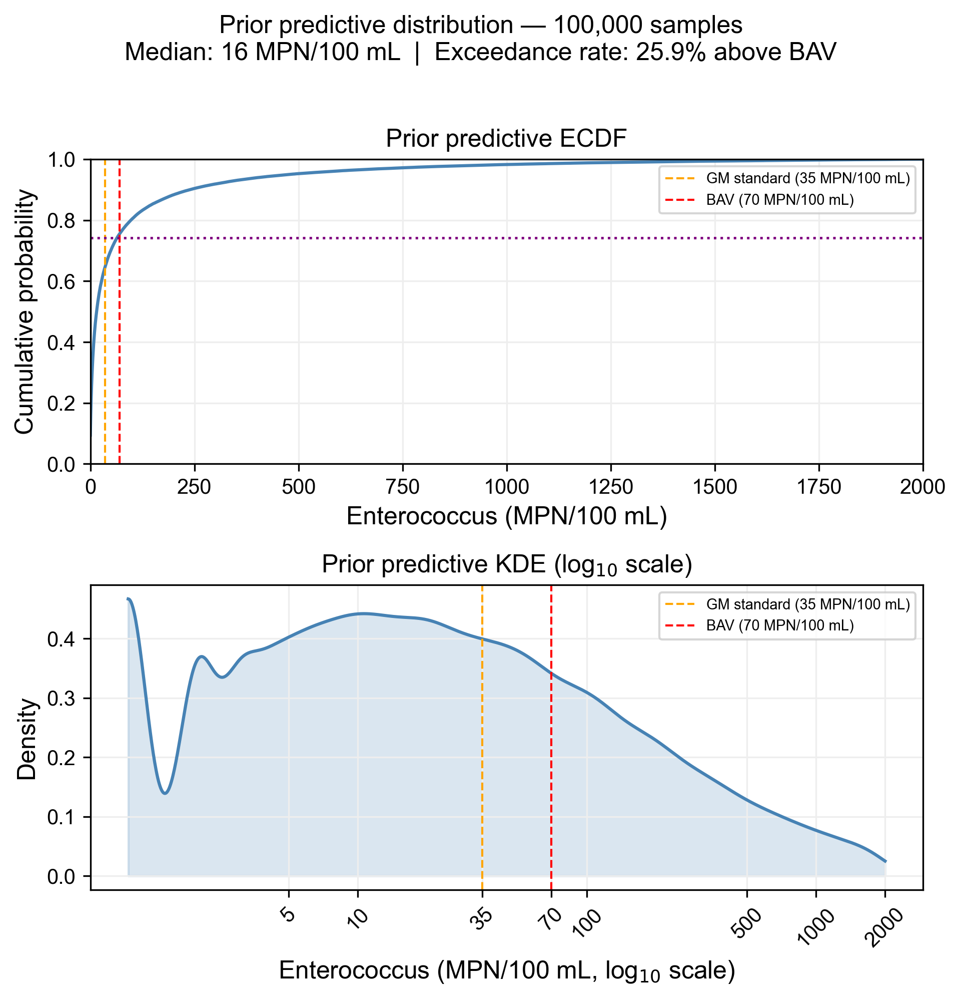

## Why priors matter — and why they are hard

Every Bayesian model requires priors. The default temptation is to reach for
something vague — a `Normal(0, 10)` or a `HalfCauchy(0, 1)` — chosen for
convenience rather than conviction. This is a missed opportunity at best and
a source of subtle bias at worst. Flat or diffuse priors are not
"non-informative": they place mass on values that are physically implausible,
and they can drag the posterior toward regions the data happen to support but
that make no scientific sense.

The alternative — **informative priors grounded in domain knowledge** — is
harder to specify but far more honest. Crucially, a prior that encodes
a specific assumption is also a prior that can be criticized, and therefore revised improved.

This post walks through a prior elicitation workflow I used for a hierarchical
model of *Enterococcus* beach contamination in an undisclosed island, in one of my ongoing projects. The study area is divided into regions, each of which can have one or more beaches. These particulars notwithstanding, the principles I described here are project-agnostic and apply wherever you have domain knowledge to bring to bear.

## A three-level model hierarchy

Following the spatial organization of the study area, the model I am developing to characterize contamination trends has a three-level structure: an island-wide baseline log-rate $\log_{10}(\mu_{global})$, region-level deviations $\delta_{region}$, and beach-level deviations $\delta_{beach}$:

$$
\begin{aligned}
\log_{10}(\mu_{beach}) &= \log_{10}(\mu_{global}) + \delta_{region} + \delta_{beach} \\
\delta_{region} &\sim \text{Normal}(0, \tau_{region}) \\
\delta_{beach} &\sim \text{Normal}(0, \tau_{beach}) \\
Y_i &\sim \text{NegativeBinomial}(\mu_{beach[i]}, \alpha)
\end{aligned}
$$ {#eq-beach-model}


Four parameters need priors: $\log_{10}(\mu_{global})$, $\tau_{region}$,
$\tau_{beach}$, and $\alpha$. Each gets its own elicitation.

::: {.callout-note title="Why log10?"}
Working on the $\log_{10}$ scale makes prior reasoning intuitive: one unit
equals a 10-fold difference in expected counts, and 0.30 units is a 2-fold
difference. Priors are elicited on this scale and converted to natural log
for PyMC: $\ln(x) = \log_{10}(x) \times \ln(10) \approx \log_{10}(x) \times 2.303$.
:::

## Maximum entropy priors

For each parameter, the prior family is chosen on maximum entropy (MaxEnt) grounds —
the least informative distribution consistent with a stated set of constraints, insuring that only our assumptions (and nothing more) are encoded in the model:

- **$\log_{10}(\mu_{global})$: Normal** — maximum entropy for an unbounded
  quantity with finite mean and variance. Choosing Normal asserts that the
  island-wide baseline log-rate has no heavy tails and no asymmetry on the
  log scale.
- **$\tau_{region}$, $\tau_{beach}$, $\alpha$: Gamma** — maximum entropy for
  a strictly positive quantity with finite mean. The Gamma also avoids the
  near-zero region that creates funnel geometry in hierarchical models.

These choices are defensible — and attackable. A critic could argue for a
half-Normal on the $\tau$ parameters or a log-Normal on $\alpha$. The prior
predictive check is the empirical arbiter.

## Literature anchoring

Before touching any elicitation tool, I establish plausible ranges from
published literature and regulatory context:

| Condition | Range (MPN/100 mL) | $\log_{10}$ range |
|---|---|---|
| Clean baseline | 1–35 | 0.00–1.54 |
| Borderline | 35–70 | 1.54–1.85 |
| Impacted | 70–500 | 1.85–2.70 |
| Severely impacted | 500–5,000 | 2.70–3.70 |
| Extreme event | 5,000–25,000 | 3.70–4.38 |

The EPA geometric mean standard (35 MPN/100 mL) and Beach Action Value (70 MPN/100 mL) anchor the borderline range. @laureano2017 document geometric mean counts of roughly 1.5–2 MPN/100 mL at a clean San Juan beach, while @boehm2007 report arithmetic means near 30 MPN/100 mL at California marine beaches. Post-storm and infrastructure failure events
can reach 5,000–25,000 MPN/100 mL [@laureano2017]. Certainly a more thorough literature review is recommended, but for the purpose of this post, this should suffice.

## Elicitation with PreliZ

[PreliZ](https://preliz.readthedocs.io) is a Python library for prior
elicitation [@preliz2024]. Rather than guessing distribution parameters directly,
you reason in terms of observable quantities and let PreliZ find the
matching distribution. The core function is `pz.maxent()`:

```python
import preliz as pz
import numpy as np

# Elicit Normal prior on log10(mu_global)
# Belief: 90% of baseline counts fall between log10(5) and log10(500)
prior_mu, _ = pz.maxent(
    pz.Normal(),
    lower=np.log10(5),    # 0.70
    upper=np.log10(500),  # 2.70
    mass=0.90
)
# → Normal(mu=1.70, sigma=0.61)
```

`pz.maxent()` returns the maximum entropy distribution of the chosen family
that places 90% of its mass between your stated bounds — the least
informative prior consistent with your belief. The interactive companion
`prior.plot_interactive()` lets you refine the result visually with sliders
(requires `ipywidgets`).

For the $\tau$ parameters, the bounds are stated as fold-differences:

```python
# tau_region: 90% mass between a 2-fold and 10-fold between-region difference
prior_tau_region, _ = pz.maxent(
    pz.Gamma(),
    lower=np.log10(2),    # 0.30
    upper=np.log10(10),   # 1.00
    mass=0.90
)
```

## Joint prior predictive check

With all four parameters elicited, the joint prior predictive check is the
critical validation step. A Bayesian model is generative — it can simulate
data from the prior alone, before fitting any observations. If the simulated
counts are physically implausible, the priors need revision regardless of
what the data say. Well-specified priors also give the sampler a sensible
starting point, reducing the iterations needed to reach the posterior and
lowering the risk of divergences.

PreliZ's `pz.predictive_explorer()` makes this interactive:

```python
def entero_prior_predictive(
    log10_mu_global = 1.25,
    sigma_mu        = 0.61,
    tau_region      = 0.66,
    tau_beach       = 0.30,
    alpha           = 5.30
):
    log10_mu_g = pz.Normal(log10_mu_global, sigma_mu).rvs()
    log10_mu_r = pz.Normal(log10_mu_g, tau_region).rvs()
    log10_mu_b = pz.Normal(log10_mu_r, tau_beach).rvs()
    mu = 10**log10_mu_b
    return pz.NegativeBinomial(mu=mu, alpha=alpha).rvs(size=52)

pz.predictive_explorer(entero_prior_predictive, samples=2000,
                       references=[70], kind_plot="ecdf")
```

Adjust the textboxes and watch the prior predictive ECDF update in real time. The key diagnostic: where does the ECDF cross the Beach Action Value (BAV) of 70 MPN/100 mL [@epa2012]? That crossing point is the prior predictive exceedance rate — what fraction of counts the prior says will exceed the threshold before seeing any data.

## Final prior predictive distribution

After iterating on the textboxes, the final elicited parameter set is:

| Parameter | Value | Interpretation |
|---|---|---|
| $\log_{10}(\mu_{global})$ | 1.25 | center at ~18 MPN/100 mL |
| $\sigma_\mu$ | 0.61 | 90% interval ~3–180 MPN/100 mL |
| $\tau_{region}$ | 0.66 | ~4.5x typical between-region fold-difference |
| $\tau_{beach}$ | 0.30 | ~2x typical within-region fold-difference |
| $\alpha$ | 5.30 | moderate overdispersion |

The static prior predictive distribution from 100,000 samples is shown below.
The BAV (70 MPN/100 mL) falls past the mode of the KDE — on the tail side —
which is the correct picture: most samples on a typical day should be below
the threshold, with exceedances being the exception. The prior exceedance
rate of ~26% is intentionally higher than the observed dataset-wide rate of
10.8% — a prior should reflect uncertainty across the full range of plausible
conditions before data narrows it down.

::: {#fig-prior-predictive}


*Prior predictive distribution from 100,000 samples. Left: ECDF on linear
scale (0–2,000 MPN/100 mL); the horizontal dotted line marks the BAV
crossing at ~74%. Right: KDE on $\log_{10}$ scale; the wiggle near zero
reflects the discrete nature of count data at very low values. Orange
dashed: EPA geometric mean standard (35 MPN/100 mL). Red dashed: BAV
(70 MPN/100 mL). ~25% of prior predictive mass falls below 5 MPN/100 mL,
consistent with genuinely clean beach scenarios and with the Enterolert
detection floor of 4–10 MPN/100 mL.*
:::

Note that this not necessarily the final prior predictive distribution. If experts are available, their feedback should be incorporated to iteratively refine the prior.

## Conversion to natural log for MCMC sampler use

MCMC samplers including my usual go-to, PyMC, uses natural log internally. Thus converting from log10 to natural log makes the sampler's job easier. The conversion is straightforward:

```python
LN10 = np.log(10)  # ≈ 2.303

# Convert elicited log10 parameters to natural log for PyMC
ln_mu_global = LOG10_MU_GLOBAL * LN10   # 1.25 * 2.303 ≈ 2.879
ln_sigma_mu  = SIGMA_MU        * LN10   # 0.61 * 2.303 ≈ 1.405
ln_tau_region = TAU_REGION     * LN10   # 0.66 * 2.303 ≈ 1.520
ln_tau_beach  = TAU_BEACH      * LN10   # 0.30 * 2.303 ≈ 0.691
# alpha operates on the raw scale — no conversion needed
```

These values feed directly into the PyMC model as prior parameters.


