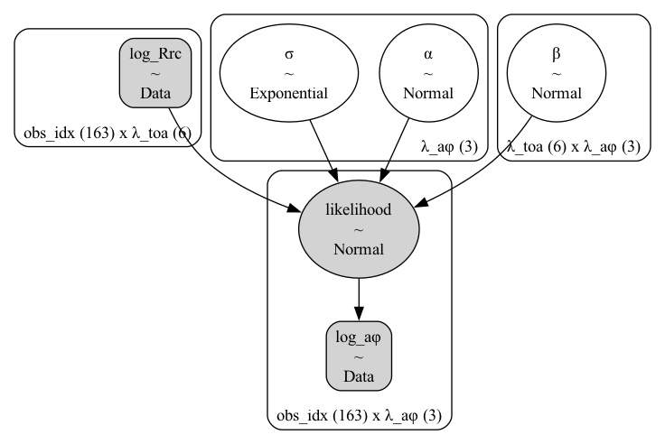
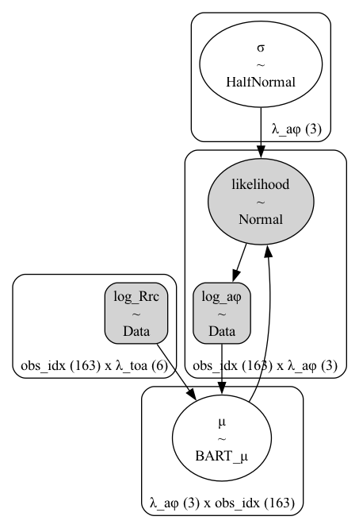
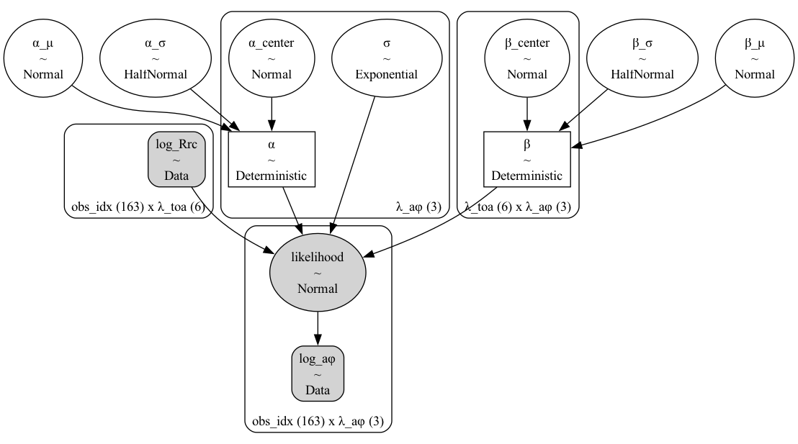
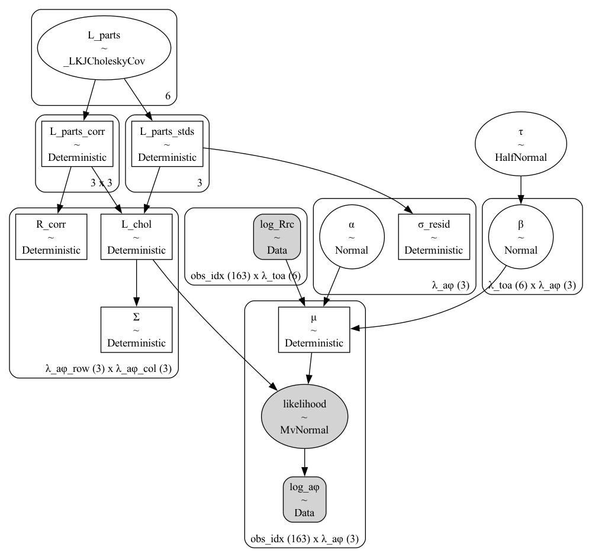

## Summary  

Satellite ocean color pipelines typically rely on **atmospheric correction (AC)** to estimate water-leaving radiance before retrieving chlorophyll and inherent optical properties (IOPs). In **optically complex (Case-2) waters**, two core assumptions often break:

- **Empirical blue:green ratios** (OCx family) presume phytoplankton-dominated blue absorption; in Case-2 waters **CDOM and non-algal particulates (NAP)** decouple from chlorophyll and strongly absorb in the blue, biasing pigment/IOP retrievals.  
- **NIR-dark ocean for AC:** productive/turbid waters often exhibit **non-negligible NIR water-leaving radiance**, so small NIR errors can flip aerosol model selection and **propagate large visible-band errors** into nLw/Rrs and downstream products.  

Enhanced AC approaches (NIR/SWIR switching, spectrum-matching, vicarious calibration), **POLYMER/mPOLYMER**, and **coupled atmosphere–ocean inversions** reduce—but do not remove—errors. Semi-analytical inversions are also **ill-posed** in multi-constituent waters (CDOM, sediments, variable phytoplankton assemblages).  

**This study explores a complementary path:** **predict phytoplankton absorption directly from top-of-atmosphere (TOA) radiance**, bypassing full AC. After minimal physics (Rayleigh and Fresnel/glint handling), we learn a **probabilistic mapping** from TOA radiance to \( \log_{10} a_\phi \), emphasizing **calibration and predictive coverage**. The aim is not to replace advanced AC universally, but to provide a **robust alternative** for Case-2 contexts and **uncertainty-aware** decision-making.  

> 💡 **See the full modeling notebook**  
> 📓 *Jupyter Notebook: Bayesian Modeling of TOA Radiance* — _link to repo_

---

## Why This Matters  

- **Problem:** Atmospheric correction often fails in coastal, estuarine, and inland waters, limiting the utility of satellite products where monitoring is most needed.  
- **Opportunity:** By going straight from **TOA radiance → absorption**, we sidestep fragile assumptions, reduce complexity, and open the door to real-time or near-surface-only applications.  
- **Bayesian advantage:** Rather than forcing a single “best” correction, models embrace uncertainty, producing calibrated predictions that are honest about what we know — and what we don’t.  

---

## The Data  

We use a **modified version of the NOMAD–SeaWiFS matchup dataset** (Werdell & Bailey, 2005).  

- **Predictors:** TOA radiances at 412, 443, 490, 510, 555, and 670 nm, corrected for Rayleigh scattering and Fresnel reflection, then **log10-transformed**.  
- **Targets:** in situ phytoplankton absorption coefficients, \(a_\phi(\lambda)\), at 443, 555, and 670 nm, also **log10-transformed**.  
- **Sample size:** 163 matched satellite–in situ observations.  

---

## The Modeling Story  

### Workflow, Evaluation, and Model Development

The modeling followed a structured **Bayesian workflow** aimed at building up complexity only when it was warranted by the data:

1. **Prior predictive checks** — to confirm that the chosen priors generate physically plausible values of $a_{\phi}$ before observing data.  
2. **Posterior sampling** — models were fit with Hamiltonian Monte Carlo (NUTS) using PyMC v5, ensuring reproducible, well-mixed posteriors.  
3. **Posterior predictive checks (PPC)** — to assess whether simulated data resembled observed $\log_{10}(a_{\phi})$.  
4. **Calibration diagnostics** — using the leave-one-out probability integral transform (LOO-PIT) to gauge whether predictive uncertainty was well calibrated.  
5. **Predictive coverage** — to test whether $50\%$, $80\%$, and $94\%$ credible intervals contained the true observations at the expected rate.  
6. **Cross-validation** — to compare models on expected out-of-sample predictive performance.

We then compared four Bayesian models of increasing structural richness:

1. **Linear model (M1)** — Baseline regression linking $\log_{10}$ TOA radiance to $\log_{10}(a_{\phi})$ for each band, assuming independent Gaussian errors (diagonal $\Sigma$).  
2. **Hierarchical linear model (M2)** — Adds partial pooling across $a_{\phi}$ bands, sharing statistical strength via shared hyperpriors; still diagonal $\Sigma$.  
3. **Bayesian Additive Regression Trees (BART, M3)** — Introduces nonlinear mean functions while retaining independent residuals (diagonal $\Sigma$).  
4. **Multivariate linear model (M4)** — Keeps a linear mean but introduces a full residual covariance matrix $\Sigma$ across bands, capturing cross-band dependencies in the errors.

The first three models used independent errors to isolate effects of the **mean function** (linearity, hierarchy, nonlinearity).  
The fourth added a full $\Sigma$ to test whether explicitly modeling **residual covariance** improved calibration and predictive skill.

> *The non-hierarchical form of M4 was intentional — to isolate the benefit of covariance structure without conflating it with hierarchical pooling.*

### Model Structures (click a panel to zoom)

::: {.grid .center style="gap: 16px;"}

::: {.g-col-6}
**M1 — Linear (independent errors)**  
{.lightbox height="220" width="100%" style="object-fit:contain; display:block; margin-top:4px;"}

*Regress log10(aph) on log10 TOA radiance; errors are independent across bands.*
:::

::: {.g-col-6}
**M2 — BART (independent errors)**  
{.lightbox height="220" width="100%" style="object-fit:contain; display:block; margin-top:4px;"}

*Nonlinear mean function using Bayesian additive regression trees; residuals are independent across bands.*
:::

::: {.g-col-6}
**M3 — Hierarchical linear (independent errors)**  
{.lightbox height="220" width="100%" style="object-fit:contain; display:block; margin-top:4px;"}

*Partial pooling across aph bands via shared hyperparameters; intercepts and slopes vary by band while errors remain independent.*
:::

::: {.g-col-6}
**M4 — Multivariate (full covariance)**  
{.lightbox height="220" width="100%" style="object-fit:contain; display:block; margin-top:4px;"}

*Linear mean with a full residual covariance matrix (Sigma) across bands; captures cross-band error dependence.*
:::

:::

*Tip: Click any panel to view a full-resolution DAG with its own caption.*

---

### Results and Comparison

All models captured the general relationship between TOA radiance and $a_{\phi}$, but their **uncertainty behavior** differed markedly.

#### PSIS-LOO Model Comparison

The figure below provides the quickest way to ...

- The **multivariate linear model** produced the most realistic posterior predictive intervals and the highest expected predictive accuracy under cross-validation.
- **Hierarchical pooling** improved stability and calibration relative to the simple linear baseline.
- **BART** underperformed at this sample size ($N = 163$), where predictor collinearity limits the benefit of nonlinear flexibility.
- Incorporating covariance among bands yielded the largest gains in both calibration and coverage.

> **Takeaway:**  
> The best-performing model was not the one with the most flexible mean function, but the one that best represented the data-generating process by capturing cross-band covariance in the residuals.

---

### Figures

---

#### Posterior Calibration and Coverage

::: {.column-page}
::: {.grid}

::: {.g-col-12}
{fig-alt="LOO-PIT calibration plot for the multivariate model."}
:::

::: {.g-col-12}
{fig-alt="Empirical coverage of HDI intervals for each $a_{\phi}$ band (443, 555, 670 nm)."}
:::

:::
:::
Calibration and coverage diagnostics.  
A flat LOO-PIT density indicates well-calibrated uncertainty; coverage near nominal ($94\%$) confirms reliable predictive intervals across the $a_{\phi}$ bands.
:::

---

#### Model Comparison

::: {.column-page}
{fig-alt="Cross-validated model comparison showing relative expected predictive accuracy." width=80%}
:::

Cross-validation ranking of the four models.  
The multivariate linear model yields the lowest expected out-of-sample predictive error, confirming that modeling residual covariance provides the largest performance gain.
:::

---

### Links and Resources

- 📊 **Data Used** [NOMAD v2 – Matchup Dataset (Werdell & Bailey, 2005)](https://oceancolor.gsfc.nasa.gov/docs/technical/NOMAD/)

- 📂 **GitHub Repository:** [TOA → $a_{\phi}$ Modeling Code](https://github.com/your-repo/path)  
- 📄 **2019 Preprint (Earlier Version):** *Craig & Karaköylü (2019). Bayesian Models for Deriving Biogeochemical Information from Satellite Ocean Color* — [Link](PLACEHOLDER_LINK_2019)  
- 📄 **Updated Preprint (This Work):** *Predicting Phytoplankton Absorption Directly from TOA Radiance Using Bayesian Models* — [Link](PLACEHOLDER_LINK_CURRENT)

